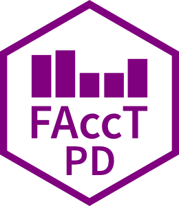

[[Paper]](https://doi.org/10.1145/3805689.3812270)   [[ArXiv]](https://arxiv.org/abs/2604.16224)   [[Pol.is Report / Data]](https://pol.is/report/r8zcsaxppvvhrbnvkceth)

# Taking Stock at FAccT  

Codebase for the ACM FAccT 2026 paper *"Taking Stock at FAccT": Using Participatory Design to Co-Create a Vision for the Fairness, Accountability and Transparency Community*.

## Analyses

The analyses / code to generate figures in the paper can be found under `src/`. The required csv files to generate the figures can be downloaded directly from the polis website displaying the results (go to top of this page), as well as in the `data/labels/` directory. To generate Figure 7 the raw_themes_classification.csv turns into themes_classification.csv, and then the figure can be produced.

### Setup

This project uses [uv](https://docs.astral.sh/uv/). To install dependencies, first [install uv](https://docs.astral.sh/uv/getting-started/installation/), then run `uv sync` in the root directory of the project. Once set up, you can run commands within the virtual environment using `uv run <command>`, or activate it with `source .venv/bin/activate`.

### Running the Analyses

All analyses to generate the figures in the paper can be conveniently run with a single command:

```bash
uv run src/main.py
```

## Report

The source files for the final report which we plan to share with the community can be found in `report/`.

### Setup

The report is written as a Quarto document and requires Quarto to render. You can find installation instructions for Quarto [here](https://quarto.org/docs/get-started/).

### Running / Rendering the Report

To render the report, you can use the following command:

```bash
quarto render report/report.qmd
```

## Citation

Shiran Dudy, Jan Simson, and Yanan Long. 2026. “Taking Stock at FAccT”: Using Participatory Design to Co-Create a Vision for the Fairness, Accountability and Transparency Community. In The 2026 ACM Conference on Fairness, Accountability, and Transparency (FAccT ’26), June 25–28, 2026, Montreal, QC, Canada. ACM, New York, NY, USA, 28 pages. https://doi.org/10.1145/3805689.3812270
